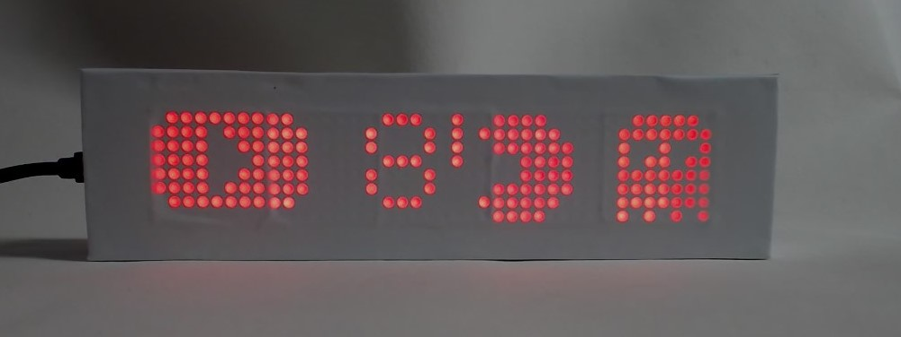
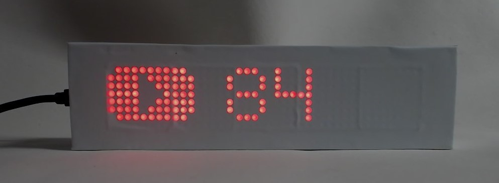
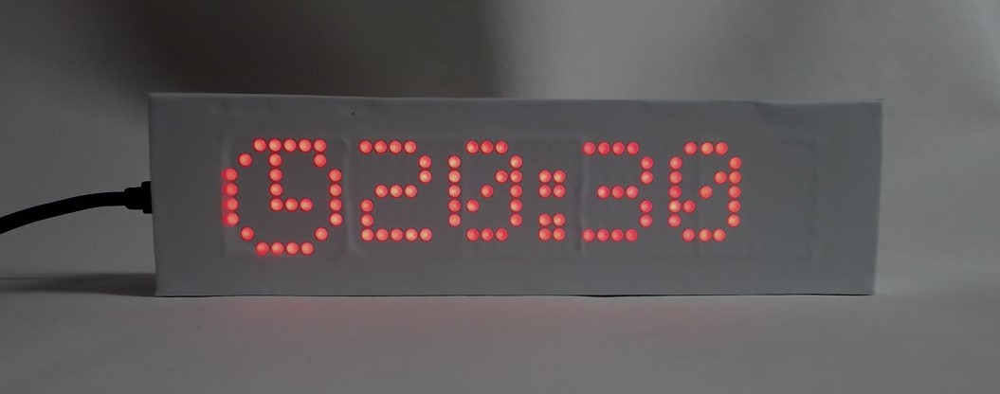
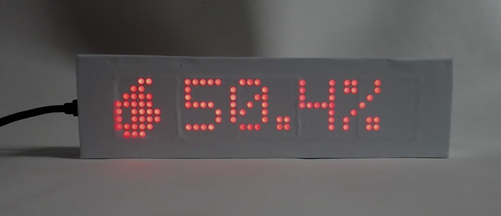
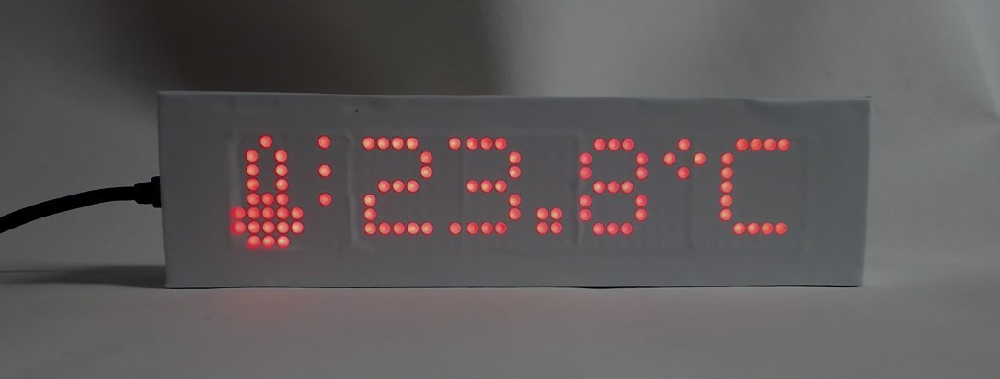

# ESP8266 Social Counter

## Beschreibung
http://www.kidbuild.de
 
## Verzeichnisstruktur
- pics = Bilder
- source = Arduino Sketch

## Projektbilder

## Changelog

### Version 2.2
- (Eisbaeeer 20201214)
+ Bugfix MAX_DEVICES wird nicht aus JSON gelesen

### Version 2.1
-(Eisbaeeer 20201119)
+ Fade-in fade-out effect added
 
### Version 2.0
- (Eisbaeeer 20201117)
+ changed libs from u8g2 to MD_MAX72xx
+ added animations

### Version 1.5
- (Eisbaeeer 20201102)
+ webpage config select mode (completely new)
+ changed font type
+ Symbols during display the time
+ New settings menu (short-press / long press)
+ Every information are separate selectable
+ New symbols
+ Font full hight
+ Temperature available (DHT11 or DHT22 sensor requiered)
+ Humidity available (DHT11 or DHT22 sensor required )

### Version 1.4
-(Eisbaeeer 20201026
+ display correct counter with logo if more than 4 modules used

### 1.3
- (Eisbaeeer 20201015)   
+ push button mode on display

### 1.2
- (Eisbaeeer 20201012)   
+ WebPage Config full support
+ Changed binary to default export of Arduino IDE
+ Changed startup mode to 7

### 1.0
- (Eisbaeeer)
Initial Version

## License
GNU Affero General Public License v3.0

## Based on
https://github.com/jegade/followercounter